# 🧪 LAB 2 — Android Rooting

<p align="center">
  
  
  
  
</p>

<p align="center">
  <b>Understanding Android rooting, verified boot impact, root validation, test application execution, traceability, and reset evidence.</b>
</p>

---

## 📌 Lab Overview

This lab focuses on understanding what Android rooting changes in a controlled laboratory environment.

The objective is not to attack a real device, but to observe how root privileges affect the Android security model, system integrity, boot trust state, and application testing workflow.

All operations were performed on an Android Virtual Device dedicated to this lab.

---

## ⚠️ Ethical and Safety Scope

| Rule | Description |
|---|---|
| Authorized environment only | The lab was performed only on a disposable Android emulator. |
| No personal device | No personal phone was rooted, flashed, or modified. |
| Test data only | No real user data or personal accounts were used. |
| Isolated context | The activity stayed inside the laboratory environment. |
| Reset required | The AVD was wiped at the end of the session. |

---

## 🧾 Environment Summary

| Item | Value |
|---|---|
| Host OS | Windows |
| Android support | Android Virtual Device |
| AVD name | `Pixel_6` |
| Device model | `sdk_gphone16k_x86_64` |
| Android version | `17` |
| API level | `37` |
| Test application | Local debug APK |
| APK path | `app/app-debug.apk` |
| Evidence log | `evidence/logcat_root_check.txt` |
| Reset performed | Yes |

---

## 📂 Repository Structure

```text
LAB2_RootingAndroid/
│
├── app/
│   └── app-debug.apk
│
├── evidence/
│   └── logcat_root_check.txt
│
├── rapport/
│   └── rapport_lab2_rooting.md
│
├── screenshots/
│   ├── 01_avd_clean_home.png
│   ├── 02_adb_devices.png
│   ├── 03_emulator_list.png
│   ├── 04_emulator_writable_system.png
│   ├── 05_adb_devices.png
│   ├── 06_adb_root.png
│   ├── 07_adb_remount.png
│   ├── 08_adb_shell_id_root.png
│   ├── 09_verifiedbootstate.png
│   ├── 10_veritymode_vbmeta.png
│   ├── 11_root_checks_before_reboot.png
│   ├── 12_reboot_after_disable_verity.png
│   ├── 13_root_checks_after_reboot.png
│   ├── 14_android_version_device_info.png
│   ├── 15_su_test_corrected.png
│   ├── 16_root_checks_after_reboot_complete.png
│   ├── 17_logcat_root_check_saved.png
│   ├── adb_install_app_success.png
│   ├── app-debug_apk_export.png
│   ├── app_launched_with_adb_monkey.png
│   ├── avd_home-screen_after_wipe_data.png
│   ├── emu_wiping_data.png
│   ├── package_name_identified.png
│   └── test_app_launched_hello_world.png
│
├── .gitignore
└── README.md
```

---

## 🎯 Objectives

The main objectives of this lab were:

| Objective | Status |
|---|---|
| Start a clean Android emulator | ✅ Done |
| Launch the emulator with writable system mode | ✅ Done |
| Enable ADB root | ✅ Done |
| Remount system partitions | ✅ Done |
| Verify root privileges | ✅ Done |
| Check Verified Boot state | ✅ Done |
| Test `su` availability | ✅ Done |
| Install and launch a test APK | ✅ Done |
| Save logs for traceability | ✅ Done |
| Reset the AVD after the lab | ✅ Done |

---

# 1. Clean AVD Preparation

A clean Android Virtual Device was used to avoid interference from previous tests, cached applications, user accounts, or residual configuration.

<p align="center">
  
</p>

The emulator was detected successfully through ADB.

```bash
adb devices
```

<p align="center">
  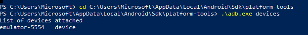
</p>

---

# 2. AVD Selection and Writable System Mode

The available AVDs were listed using the emulator command.

```bash
emulator -list-avds
```

<p align="center">
  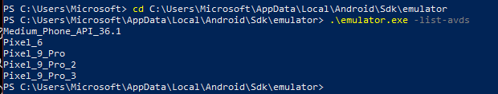
</p>

The selected AVD was launched with the `-writable-system` option.

```bash
emulator -avd Pixel_6 -writable-system
```

This mode is required when system partitions need to be remounted or modified during controlled testing.

<p align="center">
  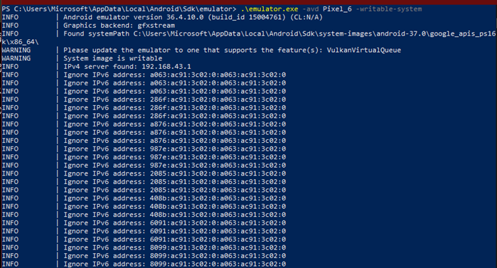
</p>

---

# 3. ADB Root Activation

After launching the emulator, the device was checked again with ADB.

```bash
adb devices
```

<p align="center">
  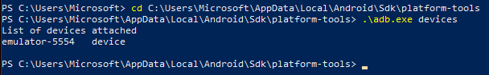
</p>

The ADB daemon was restarted with root privileges.

```bash
adb root
```

<p align="center">
  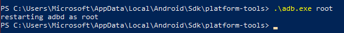
</p>

---

# 4. System Remount

The system partitions were remounted in read/write mode.

```bash
adb remount
```

The first remount operation indicated that verity was disabled and that a reboot was required for the changes to fully take effect.

<p align="center">
  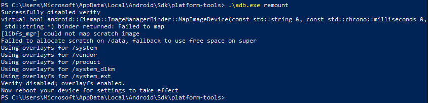
</p>

---

# 5. Root Privilege Verification

Root privileges were verified with:

```bash
adb shell id
```

Observed result:

```text
uid=0(root)
```

This confirms that the shell had root privileges.

<p align="center">
  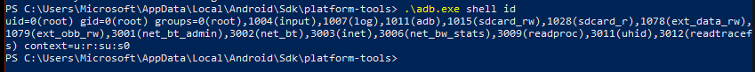
</p>

---

# 6. Verified Boot and Verity Checks

The Verified Boot state was checked using:

```bash
adb shell getprop ro.boot.verifiedbootstate
```

Observed result:

```text
orange
```

<p align="center">
  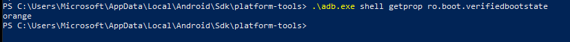
</p>

Additional boot and verity properties were checked:

```bash
adb shell getprop ro.boot.veritymode
adb shell getprop ro.boot.vbmeta.device_state
```

<p align="center">
  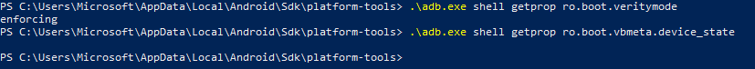
</p>

---

## 🔎 Interpretation

| Property | Observed Value | Meaning |
|---|---|---|
| `uid=0(root)` | Present | Root access confirmed |
| `ro.boot.verifiedbootstate` | `orange` | Device is in a modified or reduced trust state |
| `ro.boot.veritymode` | `enforcing` | Verity property still reports enforcing |
| `ro.boot.vbmeta.device_state` | Empty | No value returned on this AVD |
| `su` | Available | Superuser binary exists in `/system/xbin/su` |

---

# 7. Root Checks Before and After Reboot

Before reboot, the environment already showed root access and modified trust state.

<p align="center">
  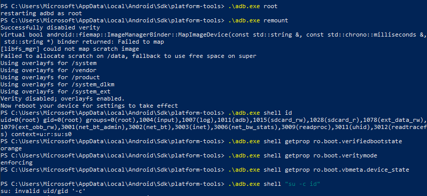
</p>

The AVD was rebooted after the remount operation.

<p align="center">
  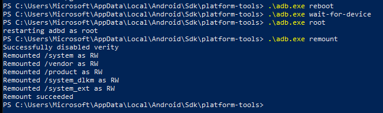
</p>

After reboot, root and remount checks were repeated.

<p align="center">
  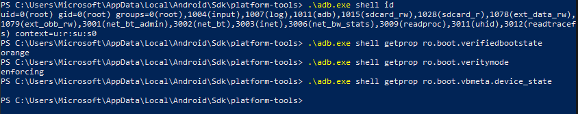
</p>

---

# 8. Android Version and Device Information

The Android version, API level, and model were collected using:

```bash
adb shell getprop ro.build.version.release
adb shell getprop ro.build.version.sdk
adb shell getprop ro.product.model
```

Observed values:

| Field | Value |
|---|---|
| Android version | `17` |
| API level | `37` |
| Model | `sdk_gphone16k_x86_64` |

<p align="center">
  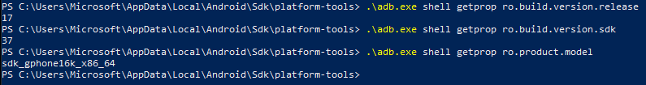
</p>

---

# 9. `su` Binary Verification

The first `su -c id` syntax was not suitable for this environment, so the corrected syntax was used:

```bash
adb shell su 0 id
adb shell which su
```

Observed results:

```text
uid=0(root)
```

```text
/system/xbin/su
```

<p align="center">
  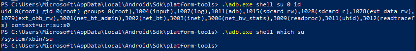
</p>

A complete root verification was then captured.

<p align="center">
  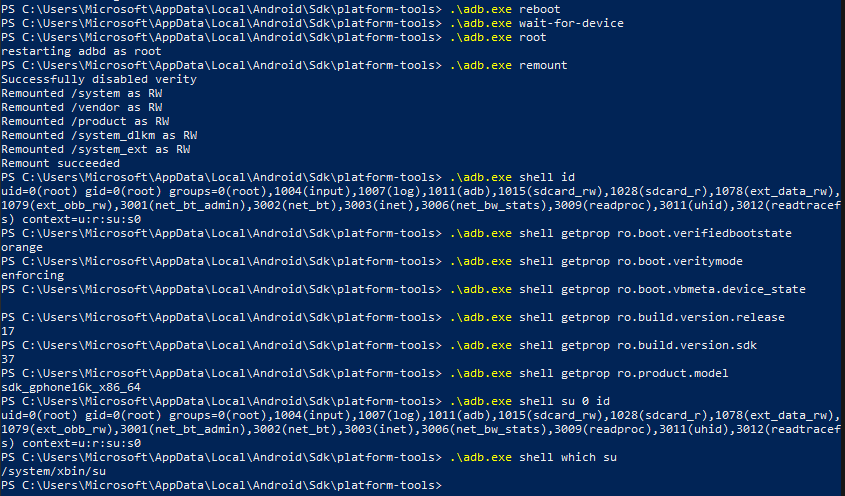
</p>

---

# 10. Test Application

Because no APK was provided by the instructor, a small local Android test application was created and exported as a debug APK.

The APK was used only to validate basic application installation and execution inside the rooted AVD.

<p align="center">
  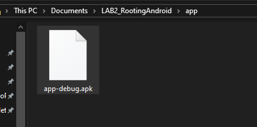
</p>

The APK was installed using ADB:

```bash
adb install -r app/app-debug.apk
```

<p align="center">
  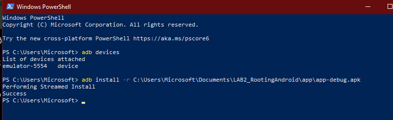
</p>

The package name was identified using:

```bash
adb shell pm list packages
```

<p align="center">
  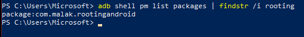
</p>

The application was launched with:

```bash
adb shell monkey -p <package_name> 1
```

<p align="center">
  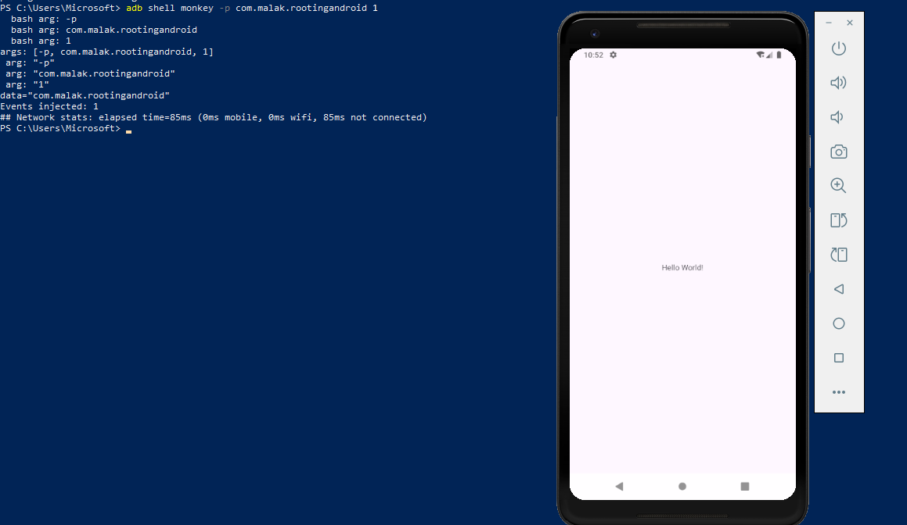
</p>

The application launched successfully on the rooted AVD.

<p align="center">
  
</p>

---

# 11. Test Scenarios

| Scenario | Action | Expected Result | Evidence |
|---|---|---|---|
| S1 | Install the APK with ADB | Installation succeeds | `adb_install_app_success.png` |
| S2 | Launch the app normally | The app opens on the emulator | `test_app_launched_hello_world.png` |
| S3 | Launch the app with `adb shell monkey` | The app starts automatically | `app_launched_with_adb_monkey.png` |

These scenarios are simple, deterministic, and repeatable.

---

# 12. Android Security Summary

Android security relies on several layers:

- Application sandboxing isolates applications from each other.
- The permission model controls access to sensitive resources.
- Verified Boot checks the integrity of the boot chain.
- AVB strengthens the boot verification process.
- Rooting changes the trust assumptions of the device.
- Therefore, rooting must only be tested in an isolated lab environment.

---

# 13. Verified Boot and AVB

## Verified Boot

Verified Boot aims to ensure that the Android system being loaded has not been modified in an unauthorized way.

## Chain of Trust

The chain of trust means that each boot component verifies the next one before giving it control.

```text
ROM → Bootloader → Boot image verification → System verification → Android Runtime
```

## Why Boot Integrity Matters

If the boot process is compromised, later security mechanisms can be bypassed before Android fully starts.

## AVB

Android Verified Boot, also called AVB, is the modern implementation of Verified Boot.  
It adds stronger integrity verification and rollback protection to prevent the device from booting older vulnerable versions.

---

# 14. Rooting Definition

Rooting means obtaining super-user privileges on Android.

It allows access to system areas that are normally protected from standard applications and users.

In a laboratory, rooting helps observe low-level behavior, storage protection, and security assumptions.

However, rooting is risky and must be limited to isolated, authorized, and resettable environments.

---

# 15. Laboratory Interest

In a lab, a privileged environment can help to:

| Use Case | Description |
|---|---|
| Observe protected artifacts | Access files and properties normally hidden from regular users |
| Analyze runtime behavior | Understand how apps behave under modified trust conditions |
| Test storage assumptions | Check whether an app relies only on Android sandboxing |
| Validate defensive design | Identify whether sensitive data is protected even on rooted devices |

This remains strictly limited to an authorized laboratory environment.

---

# 16. Risk Matrix

| Risk | Impact |
|---|---|
| Integrity not guaranteed | Security conclusions may be biased because the system is modified. |
| Increased attack surface | A rooted device exposed outside the lab becomes easier to compromise. |
| Sensitive data exposure | Private files may become accessible with elevated privileges. |
| System instability | Tests may become unreliable or difficult to reproduce. |
| Personal/test account mixing | Personal data may leak into the lab environment. |
| Poor cleanup | Test artifacts may persist after the session. |
| Non-isolated network | Lab activity may affect external systems unintentionally. |
| Weak traceability | Results cannot be reproduced or audited properly. |

---

# 17. Defensive Measures

| Measure | Purpose |
|---|---|
| Isolated network | Prevent uncontrolled communication with external systems. |
| Fake data only | Avoid exposing real sensitive data. |
| Dedicated AVD | Keep the lab separate from personal usage. |
| Wipe after testing | Restore the environment to a clean state. |
| Configuration journal | Make the work reproducible. |
| No personal accounts | Avoid mixing private and test identities. |
| Controlled APKs only | Reduce risks from unknown applications. |
| Screenshots and timestamps | Preserve evidence and traceability. |

---

# 18. OWASP MASVS Requirements

## MASVS-STORAGE

Sensitive data should be stored securely.  
Examples include tokens, API keys, credentials, and personal information.

## MASVS-NETWORK

Network communication should be protected using secure transport mechanisms such as TLS with proper certificate validation.

---

# 19. OWASP MASTG Test Ideas

| Test Idea | Description |
|---|---|
| Local storage review | Check whether sensitive data appears in local application files such as shared preferences or databases. |
| Log analysis | Use `adb logcat` to detect whether the application leaks sensitive information during execution. |

With root access, some local paths become easier to inspect, which helps understand how an attacker with elevated privileges may observe application behavior.

---

# 20. Traceability Evidence

Logcat output was saved to preserve evidence of the testing session.

```bash
adb logcat -d | Select-Object -Last 200 | Out-File -Encoding utf8 evidence/logcat_root_check.txt
```

<p align="center">
  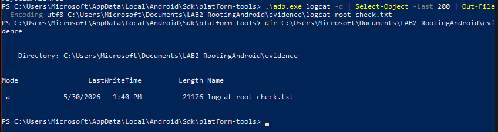
</p>

A second capture also confirms the saved log evidence.

<p align="center">
  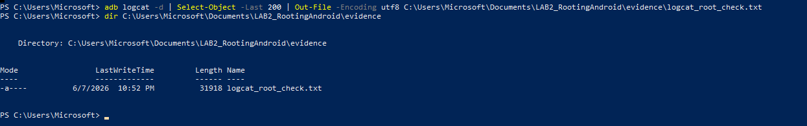
</p>

---

# 21. Reset and Cleanup

At the end of the lab, the emulator was stopped.

```bash
adb emu avd stop
```

<p align="center">
  
</p>

The AVD data was wiped to return to a clean state.

<p align="center">
  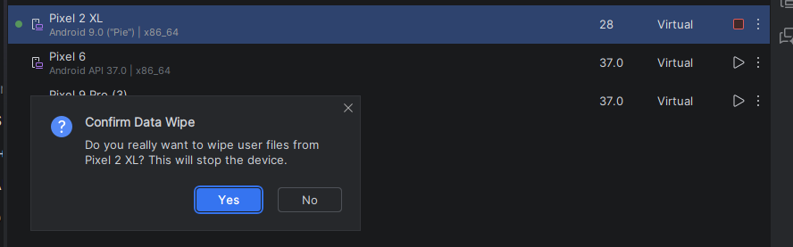
</p>

After wiping, the emulator returned to a clean home screen.

<p align="center">
  
</p>

---

# 22. Final Checklist

## Before Testing

| Check | Status |
|---|---|
| Scope defined | ✅ |
| Clean AVD used | ✅ |
| No personal account used | ✅ |
| Test APK prepared | ✅ |
| Android version recorded | ✅ |
| ADB device detected | ✅ |

## During Testing

| Check | Status |
|---|---|
| AVD started with writable system | ✅ |
| `adb root` executed | ✅ |
| `adb remount` executed | ✅ |
| Root verified with `id` | ✅ |
| Verified Boot state checked | ✅ |
| `su` tested | ✅ |
| Test app installed and launched | ✅ |

## After Testing

| Check | Status |
|---|---|
| Logcat evidence saved | ✅ |
| AVD stopped | ✅ |
| AVD wiped | ✅ |
| Reset proof captured | ✅ |
| Evidence organized | ✅ |
| Repository prepared | ✅ |

---

# 23. Key Findings

| Finding | Result |
|---|---|
| Root access | Successfully obtained |
| Shell privilege | `uid=0(root)` |
| Verified Boot state | `orange` |
| Remount | Successful after reboot |
| `su` binary | Present in `/system/xbin/su` |
| Test APK | Installed and launched successfully |
| Logs | Saved in `evidence/logcat_root_check.txt` |
| Reset | Completed and documented |

---

# 24. Conclusion

This lab demonstrated the impact of rooting in a controlled Android emulator environment.

The AVD was launched with writable system support, ADB root was enabled, system partitions were remounted, and root privileges were confirmed using both `adb shell id` and `su`.

The Verified Boot state changed to an orange trust state, showing that the system was no longer in a fully trusted boot condition.

A local test APK was installed and launched successfully, allowing simple reproducible scenarios to be documented.

Finally, traceability was preserved through screenshots and logcat evidence, and the AVD was wiped to restore a clean environment.

---

## 📚 References

- Android Security Documentation: https://source.android.com/docs/security
- Android Verified Boot: https://source.android.com/docs/security/features/verifiedboot
- Android Verified Boot 2.0: https://source.android.com/docs/security/features/verifiedboot/avb
- Android Debug Bridge: https://developer.android.com/tools/adb
- OWASP MASVS: https://mas.owasp.org/MASVS/
- OWASP MASTG: https://mas.owasp.org/MASTG/

---

<p align="center">
  <b>LAB 2 completed successfully — Android Rooting in a controlled AVD environment.</b>
</p>